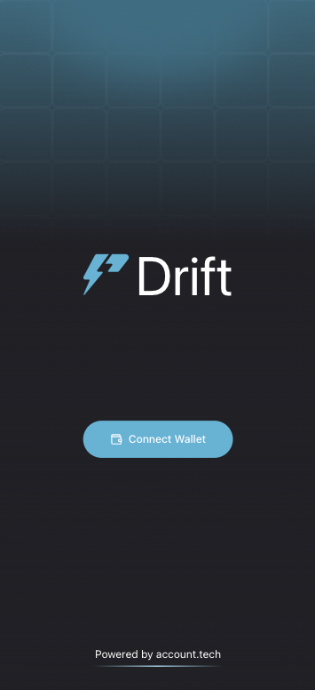
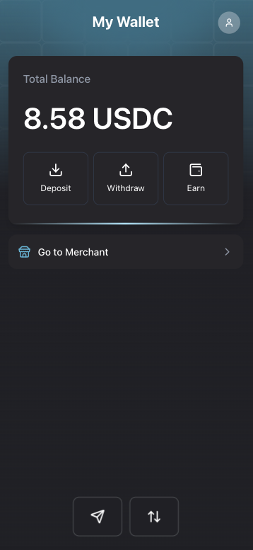
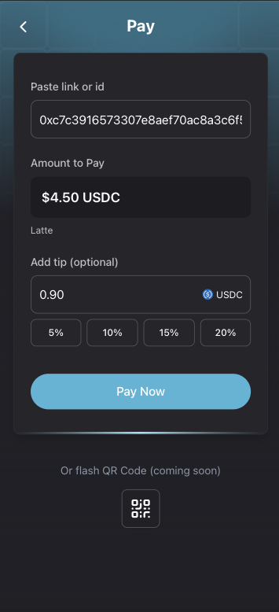

# 🌊 Drift - Sui Blockchain Payment Platform

<div align="center">
  
  
  **A modern, secure payment platform built on the Sui blockchain**
  
  [](https://nextjs.org/)
  [](https://www.typescriptlang.org/)
  [](https://sui.io/)
  [](https://account.tech/)
</div>

## 🎯 Our Vision

The future of payments is **transparent, efficient, and accessible**. Drift represents the next generation of payment infrastructure, leveraging blockchain technology to create seamless financial interactions.

## 💡 What We're Building

Drift is a **secure and extensible payment platform** built on Sui blockchain, designed to empower:

- ⚡ **Instant transactions** with minimal costs
- 💰 **Multi-currency support** (SUI, USDC) with optional tips
- 🏪 **Merchant-focused tools** for businesses to create and manage payment requests
- 📱 **Mobile-first experience** with QR code integration
- 🔐 **Advanced security** including social recovery and backup addresses
- 🔗 **Seamless integration** capabilities for existing systems
- 🎁 **Extensible architecture** ready for future innovations

## 🎯 How It Works

1. **Merchants** create payment accounts and issue payment requests with custom descriptions and amounts
2. **Customers** receive payment links or scan QR codes to complete transactions instantly
3. **Security** is enhanced through social recovery options and backup addresses, eliminating single points of failure
4. **Transparency** is built-in with all transactions recorded on the Sui blockchain

## 👥 Who We Serve

- **Businesses** seeking modern, cost-effective payment solutions
- **Developers** building payment applications and integrations
- **Users** who value transparent and efficient payment methods
- **DeFi projects** requiring composable payment infrastructure

## 📱 Mobile-First Design

Drift is optimized for mobile use and works seamlessly with the **Nightly wallet app** on mobile devices, providing a native-like experience for both merchants and customers.

## 📸 Screenshots

<div align="center">
  
  
  
</div>

*Mobile-optimized interface designed for use with Nightly wallet app*

## ✨ Key Features

### 💳 **Multi-Account Management**
- Create and manage multiple merchant payment accounts
- Secure wallet integration with Sui dApp Kit
- Account recovery and backup address functionality
- Real-time balance tracking for SUI and USDC

### 📱 **QR Code Integration**
- Generate QR codes for payment requests
- Mobile-optimized QR code scanner
- Instant payment processing via QR scanning
- Cross-platform compatibility (iOS/Android)

### 💰 **Payment Processing**
- Issue payment requests with custom descriptions
- Support for USDC and SUI tokens
- Optional tip functionality
- Real-time payment status tracking
- Automatic payment expiration handling

### 🔄 **Transaction Management**
- View pending and completed payments
- Withdraw funds to external addresses
- Delete expired payment requests
- Comprehensive transaction history

### 🛡️ **Security & Recovery**
- **Social recovery** options to eliminate single points of failure
- **Backup address** configuration for account recovery
- Multi-signature support
- Secure intent-based transactions
- Dependency version management

### 🎨 **Modern UI/UX**
- Dark theme optimized interface
- Responsive design for all devices
- Smooth animations and transitions
- Intuitive navigation and user flows

## 🏗️ Architecture

Drift is built using a modern tech stack optimized for blockchain applications:

- **Frontend**: Next.js 15 with TypeScript and Tailwind CSS
- **Blockchain**: Sui blockchain integration via Sui dApp Kit
- **SDK**: Account.tech Payment SDK for secure transaction handling
- **State Management**: Zustand for efficient state management
- **UI Components**: Radix UI primitives with custom styling
- **Mobile Wallet**: Optimized for Nightly app integration

## 🚀 Getting Started

### Prerequisites

- Node.js 18+ 
- pnpm (recommended) or npm
- A Sui wallet (Nightly app recommended for mobile, Sui Wallet for desktop)

### Installation

1. **Clone the repository**
   ```bash
   git clone <repository-url>
   cd drift-payments
   ```

2. **Install dependencies**
   ```bash
   pnpm install
   # or
   npm install
   ```

3. **Set up environment variables**
   ```bash
   cp .env.example .env.local
   ```
   
   Configure your environment variables as needed.

4. **Run the development server**
   ```bash
   pnpm dev
   # or
   npm run dev
   ```

5. **Open your browser**
   Navigate to [http://localhost:3000](http://localhost:3000)

### Building for Production

```bash
pnpm build
pnpm start
```

### Supported Tokens

- **SUI**: Native Sui token for gas fees
- **USDC**: Primary payment token

## 📚 SDK Integration

Drift leverages the Account.tech SDK for secure payment processing:

```typescript
import { PaymentClient } from "@account.tech/payment";

// Initialize payment client
const client = await PaymentClient.init(NETWORK_TYPE, userAddress, paymentAccountId);

// Create payment request
await client.issuePayment(transaction, description, coinType, amount);

// Process payment
await client.makePayment(transaction, intentId, tipAmount);
```

## 🛠️ Development

### Project Structure

```
src/
├── app/                # Next.js app router pages
│   ├── merchant/       # Merchant account management
│   ├── pay/            # Payment processing
│   ├── withdraw/       # Withdrawal functionality
│   └── deposit/        # Deposit functionality
├── components/         # Reusable UI components
├── hooks/              # Custom React hooks
├── store/              # Zustand state management
├── utils/              # Utility functions
├── types/              # TypeScript type definitions
└── constants/          # App constants
```

### Available Scripts

```bash
pnpm dev          # Start development server
pnpm build        # Build for production
pnpm start        # Start production server
pnpm lint         # Run ESLint
```

## 📄 License

This project is licensed under the MIT License - see the [LICENSE](LICENSE) file for details.

## 🙏 Acknowledgments

- [Account.tech](https://account.tech/) for the payment SDK
- [Sui Foundation](https://sui.io/) for the blockchain infrastructure
- [Next.js](https://nextjs.org/) for the React framework
- [Tailwind CSS](https://tailwindcss.com/) for styling
- [Nightly](https://nightly.app/) for mobile wallet integration


---

<div align="center">
  <strong>Built with ❤️ on Sui blockchain</strong>
</div>
